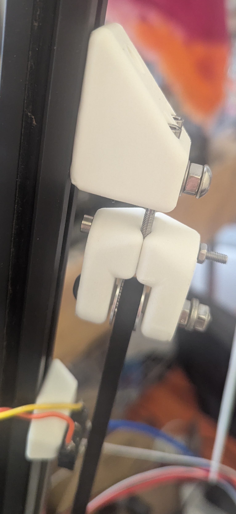
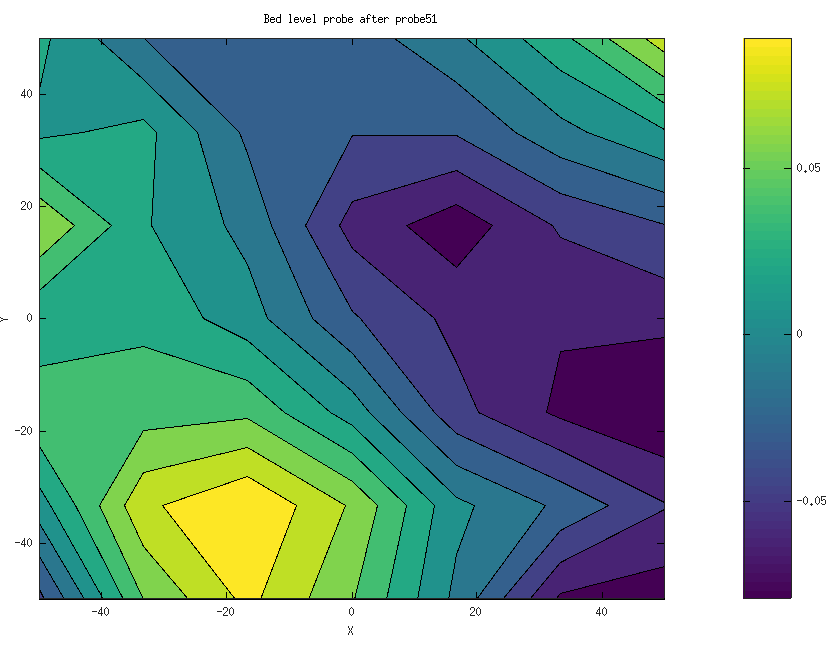

# Tilted Delta Development Notes
## Added tilted_delta kinematics to klipper
Initial build had a switch mounted on effector, which could
be considered to be a zero offset bed probe.
New kinematics got running in Klipper.
[Bed probe running under Klipper](https://youtu.be/T_cUYRJ55_Q "Bed probe running under Klipper").
I am maintaining a [branch of klipper](https://github.com/Mr-What/klipper/tree/tilted-delta-kinematics-dev "tilted-delta-kinematics-dev branch of klipper") with the tilted_delta kinematics.

## COTS effector trial

Initial build was using a COTS effector

where the hot end was mounted with a hinge, and pre-loaded with a spring.
This was not repeatable enough to use for a bed probe.

## Experimental Kinematic Mount hot-end probe

Placed hot-end on a kinematic mount,

which was wired to detect when contact is lost on any of the six contact points.
This was made with parts on hand.
Never complete as a print head.

It seemed to work for a while, but with unpredictable results.
I measured that it took about 400g-force to release the kinematic mount.
I think that the printer is likely to flex and settle given this much force, and I expect that it gave different readings depending on probe location.
I also noted that the first probe or two were often very different to subsequent probes, which did converge.
I think that the frame stretches and moves for the first two probes before becoming repeatable.

Then I got a problem where probes got worse and worse as time progressed, then it would fail upon detecting a bed crash.

I installed a traditional limit switch with offset to the nozzle.
I saw the same problem.
It took a long time for me to figure out that something was wrong with stepper A.
I marked the belt and pulley at location (0,0,150).
I then ran a probe until it stopped on bed crash.
I commanded it to return to (0,0,150), and noted that the belt was around 12mm from the marked position for (0,0,150), which is very close to the amount of error needed for a bed crash.

I replaced stepper A with a slightly higher torque one, and this problem seemed to go away.

Having already developed kinematic mounts,
I completed the design to hold hot end on a kinematic mount.

This effector has a removable probe switch and a kinematic mount for the hot end, which can be wired into a bed probe.

### 260715

I have not yet wired new complete kinematic hot end probe,
but I ran a pressure test.  It got up to about 500g, then jumped down to about 450.  I think that might be where contact was broken.
As I kept moving down, I saw it varying from 350 to 400.

Repeating with the proposed proxy probe, which has likely 306 or 304 balls as opposed to 440c on the complete nozzle assembly, I think the release force is perhaps a little over 28g.
I don't know if I actually saw the release force, since it went from 0g to 28g in my shortest step of 0.025mm.
The measured force stayed about the same from there.
The mass of the probe is 16g, so I think I was seeing that
plus about 10g of magnetic pre-load. 

### 260720

Noted belt slip on stepper A, even after new motor.
In retrospect, I should have known.
Marked belt and pulley position after `G28;G0 X0 Y0 Z150`.
After a run, then `G0 X0 Y0 Z0` noted that dots did not align.
After another `G28` dots aligned on the idler but not the pulley.
The only way this could happen is if belt slipped.

Cleaned pulley, replaced belt, and installed new
idler tensioner.

I obtained a decent probe using switch.

It appears to be a clean tilt, indicating an error
in stepper A endstop position.
This is expected, after replacing much stepper A hardware.

Ran with zero offset setting.
Current switch offset measured at (0,-10,-2.2)
from nozzle on kinematic mounted hot end.

I plan to apply offset adjustment in analysis code.
It is not clear that typical offset application is
the best way to go with a delta.
Errors are often X-Y dependant, primarily due to un-modeled
effector tilt.
It might be better to assume bed probe is at commanded X-Y,
and accept that there will be a small Z error for the offset.
We know that we are primarily measuring build imperfections.
The plate could be assumed to be flat, but tilted to adjust.

### 260721

Could not get repeatability with light kinematic probe.

I asked perplexity for what ball materials might be available between the very strongly magnetic 440c,
and the weak magnetism of my light probe, likely a 304 or 316.
It suggested a common carbon steel, like 52100,
or ferritic stainless, like 430.

Claude notes that magnitism drops significantly with a small gap.
However, I still need conductivity, and hardness.
Perhaps I can fabricate removable (or wired) non-magnetic face covers.

### 260722

Cleaned drive pulley A, new belt, and new adjustable belt
tension device
Did a bed level probe,

 and was able to print test pattern.