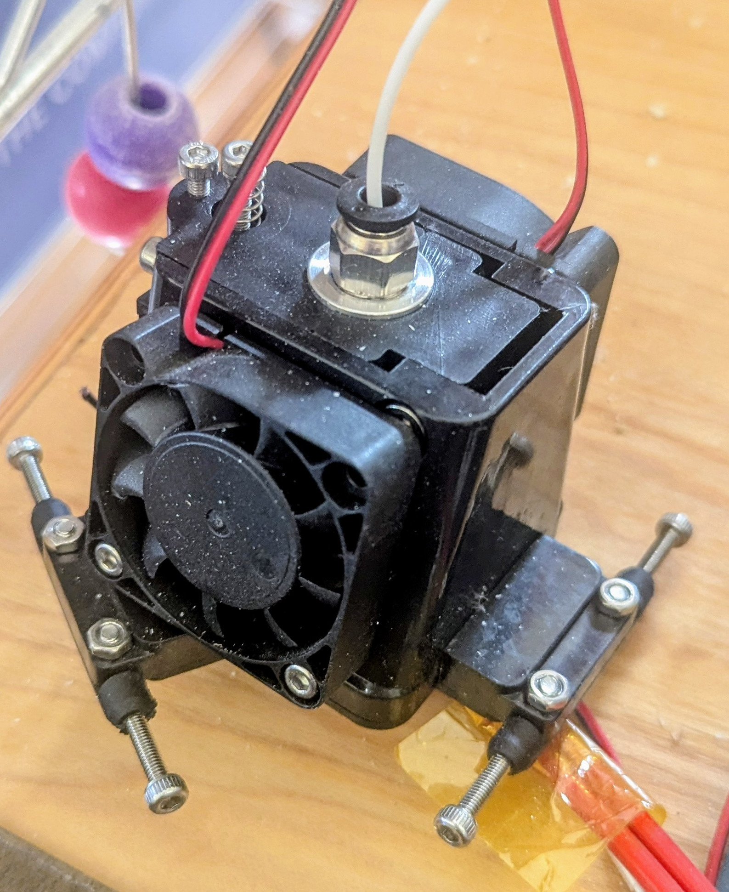
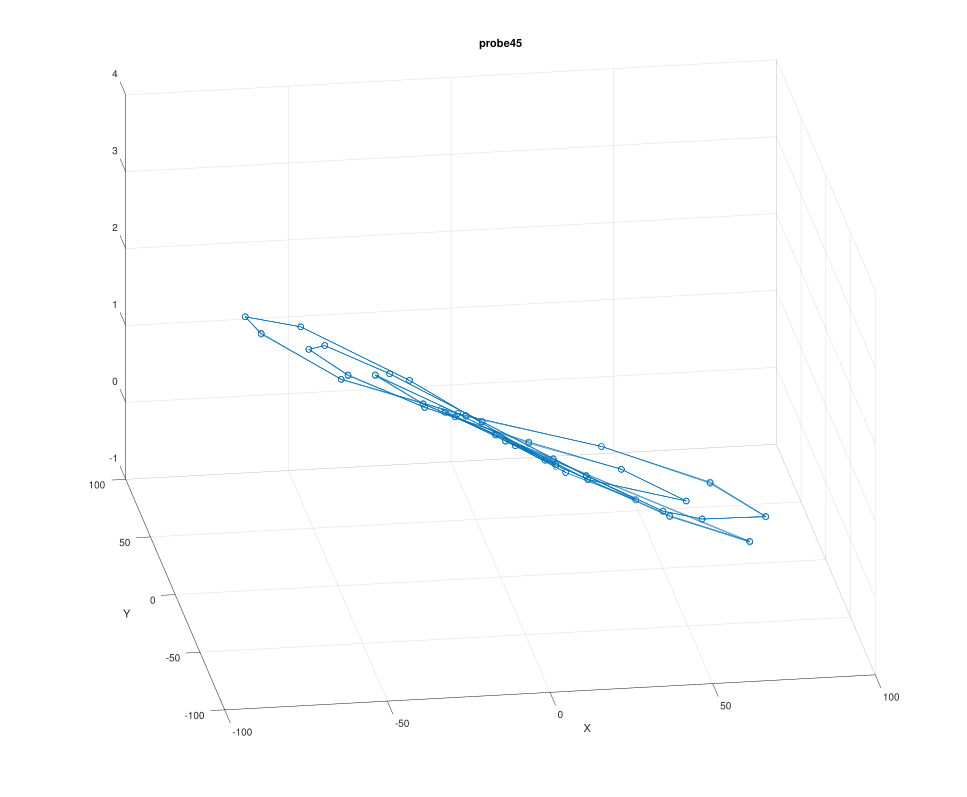

# Tilted Delta Development Notes
## Added tilted_delta kinematics to klipper
Initial build had a switch mounted on effector, which could
be considered to be a zero offset bed probe.
New kinematics got running in Klipper.
[Bed probe running under Klipper](https://youtu.be/T_cUYRJ55_Q "Bed probe running under Klipper").
I am maintaining a [branch of klipper](https://github.com/Mr-What/klipper/tree/tilted-delta-kinematics-dev "tilted-delta-kinematics-dev branch of klipper") with the tilted_delta kinematics.

## COTS effector trial

Initial build was using a COTS effector

where the hot end was mounted with a hinge, and pre-loaded with a spring.
This was not repeatable enough to use for a bed probe.

## Experimental Kinematic Mount hot-end probe

Placed hot-end on a kinematic mount,

which was wired to detect when contact is lost on any of the six contact points.
This was made with parts on hand.
Never complete as a print head.

It seemed to work for a while, but with unpredictable results.
I measured that it took about 400g-force to release the kinematic mount.
I think that the printer is likely to flex and settle given this much force, and I expect that it gave different readings depending on probe location.
I also noted that the first probe or two were often very different to subsequent probes, which did converge.
I think that the frame stretches and moves for the first two probes before becoming repeatable.

Then I got a problem where probes got worse and worse as time progressed, then it would fail upon detecting a bed crash.

I installed a traditional limit switch with offset to the nozzle.
I saw the same problem.
It took a long time for me to figure out that something was wrong with stepper A.
I marked the belt and pulley at location (0,0,150).
I then ran a probe until it stopped on bed crash.
I commanded it to return to (0,0,150), and noted that the belt was around 12mm from the marked position for (0,0,150), which is very close to the amount of error needed for a bed crash.

I replaced stepper A with a slightly higher torque one, and this problem seemed to go away.

Having already developed kinematic mounts,
I completed the design to hold hot end on a kinematic mount.

This effector has a removable probe switch and a kinematic mount for the hot end, which can be wired into a bed probe.
