# Tilted Delta Development Notes
## Added tilted_delta kinematics to klipper
Initial build had a switch mounted on effector, which could
be considered to be a zero offset bed probe.
New kinematics got running in Klipper.
[Bed probe running under Klipper](https://youtu.be/T_cUYRJ55_Q "Bed probe running under Klipper").
I am maintaining a [branch of klipper](https://github.com/Mr-What/klipper/tree/tilted-delta-kinematics-dev "tilted-delta-kinematics-dev branch of klipper") with the tilted_delta kinematics.

## COTS effector trial

Initial build was using a COTS effector

where the hot end was mounted with a hinge, and pre-loaded with a spring.
This was not repeatable enough to use for a bed probe.

## Experimental Kinematic Mount hot-end probe

Placed hot-end on a kinematic mount,
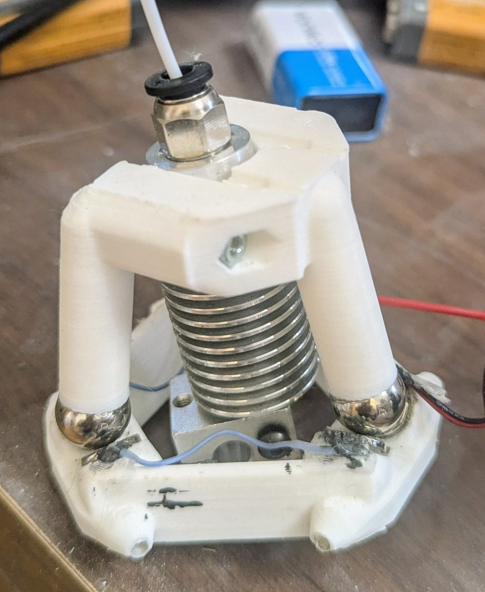
which was wired to detect when contact is lost on any of the six contact points.
This was made with parts on hand.
Never complete as a print head.

It seemed to work for a while, but with unpredictable results.
I measured that it took about 400g-force to release the kinematic mount.
I think that the printer is likely to flex and settle given this much force, and I expect that it gave different readings depending on probe location.
I also noted that the first probe or two were often very different to subsequent probes, which did converge.
I think that the frame stretches and moves for the first two probes before becoming repeatable.

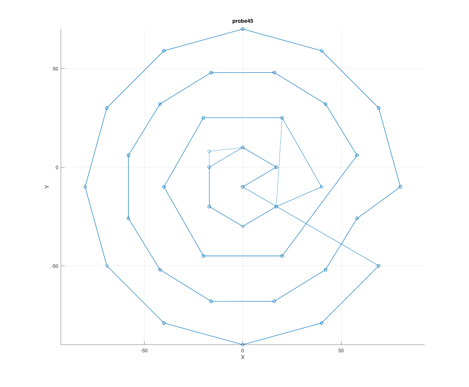

Then I got a problem where probes got worse and worse as time progressed, then it would fail upon detecting a bed crash.
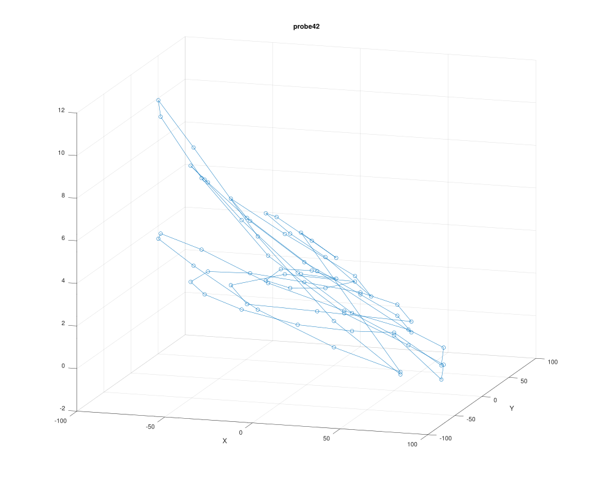

I installed a traditional limit switch with offset to the nozzle.
I saw the same problem.
It took a long time for me to figure out that something was wrong with stepper A.
I marked the belt and pulley at location (0,0,150).
I then ran a probe until it stopped on bed crash.
I commanded it to return to (0,0,150), and noted that the belt was around 12mm from the marked position for (0,0,150), which is very close to the amount of error needed for a bed crash.

I replaced stepper A with a slightly higher torque one, and this problem seemed to go away.


Having already developed kinematic mounts,
I completed the design to hold hot end on a kinematic mount.
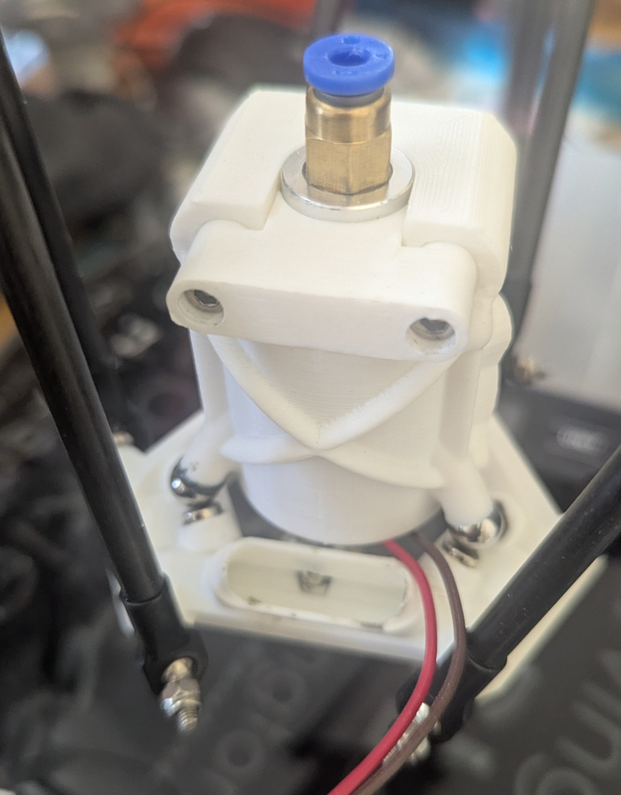
This effector has a removable probe switch and a kinematic mount for the hot end, which can be wired into a bed probe.

### 260715

I have not yet wired new complete kinematic hot end probe,
but I ran a pressure test.  It got up to about 500g, then jumped down to about 450.  I think that might be where contact was broken.
As I kept moving down, I saw it varying from 350 to 400.

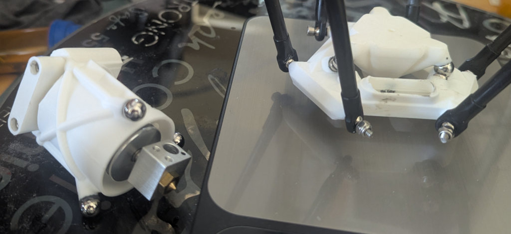

Repeating with the proposed proxy probe, which has likely 306 or 304 balls as opposed to 440c on the complete nozzle assembly, I think the release force is perhaps a little over 28g.
I don't know if I actually saw the release force, since it went from 0g to 28g in my shortest step of 0.025mm.
The measured force stayed about the same from there.
The mass of the probe is 16g, so I think I was seeing that
plus about 10g of magnetic pre-load. 

### 260720

Noted belt slip on stepper A, even after new motor.
In retrospect, I should have known.
Marked belt and pulley position after `G28;G0 X0 Y0 Z150`.
After a run, then `G0 X0 Y0 Z0` noted that dots did not align.
After another `G28` dots aligned on the idler but not the pulley.
The only way this could happen is if belt slipped.

Cleaned pulley, replaced belt, and installed new
idler tensioner.

I obtained a decent probe using switch.
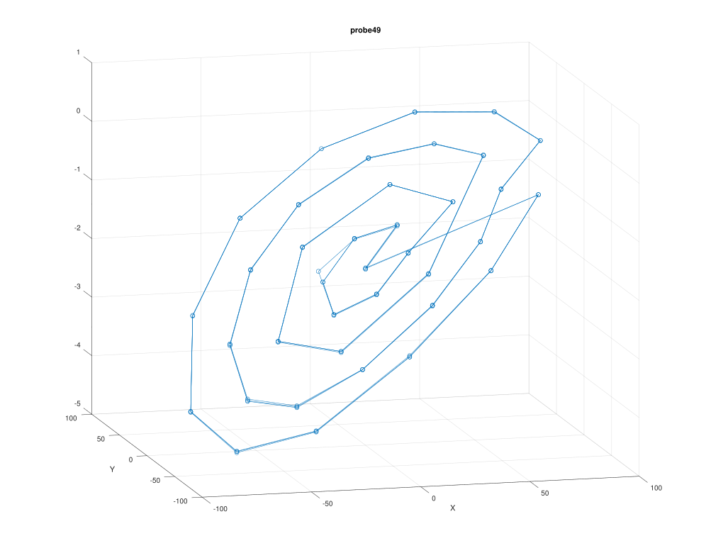
It appears to be a clean tilt, indicating an error
in stepper A endstop position.
This is expected, after replacing much stepper A hardware.

Ran with zero offset setting.
Current switch offset measured at (0,-10,-2.2)
from nozzle on kinematic mounted hot end.

I plan to apply offset adjustment in analysis code.
It is not clear that typical offset application is
the best way to go with a delta.
Errors are often X-Y dependant, primarily due to un-modeled
effector tilt.
It might be better to assume bed probe is at commanded X-Y,
and accept that there will be a small Z error for the offset.
We know that we are primarily measuring build imperfections.
The plate could be assumed to be flat, but tilted to adjust.

### 260721

Could not get repeatability with light kinematic probe.

I asked perplexity for what ball materials might be available between the very strongly magnetic 440c,
and the weak magnetism of my light probe, likely a 304 or 316.
It suggested a common carbon steel, like 52100,
or ferritic stainless, like 430.

Claude notes that magnitism drops significantly with a small gap.
However, I still need conductivity, and hardness.
Perhaps I can fabricate removable (or wired) non-magnetic face covers.

### 260722

Cleaned drive pulley A, new belt, and new adjustable belt
tension devic
Did a bed level probe,

 and was able to print test pattern.
 
 ### 260724
 
Was able to do some test prints.
We need significantly different parameters for eSun PLA+ vs elegoo PLA+.
Got some decent small prints with elegoo.
Demos for Quelab re-opening tomorrow.

### 260727

Trying to get light probe as close as possible to
actual hot-end toolhead.

#### Bed Probes at (0,0)

|    |    |
| ---|--- |
| Nozzle catches paper | -0.425 |
| Light probe catches paper | -0.450 |
| Nozzle probe | -0.571 |
| light probe | -0.516 |

I think it makes most sense to base the offset
from where the light probe triggers to at or
slightly below where the nozzle catches paper.
How many microns thick is typical newsprint?
I am always confused by the sign for the offset,
so our offset should be +- 0.091.

### 260730

Printer was demonstrated at Quelab re-opening party
on 7/25/2026.
Work is continuing at home.

I have been having issues with the kinematic probe/sensors working.
It seems that they can reduce or go away by cleaning the contact
surfaces with isopropyl alchahol (IPA).
Acetone might be better, but it also might melt IPA or PETG.

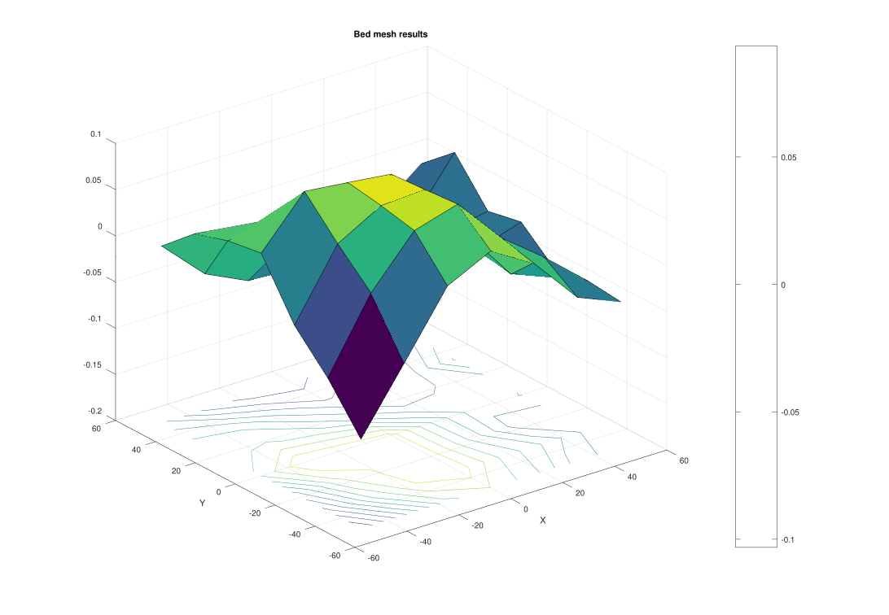
<!--  -->

I am re-running probes on a bed that has adhesive on it
to print without a bed heater.
This might raise the bed surface about 0.1mm in a random
fashion.
I don't think this will be a problem for the calibration.
It is just a little extra noise.
I had been experimenting with weights on the probe to improve
contact.
I don't think it really helps.
It seems to be running OK without weight after cleaning.
The problem with weight, is although it improves downward
preload force, it is also a challenge to move laterally to
the lowest energy position.
Using the weak ferromatnetic balls, likely 304 stainless or 316,
they may not have the strength to center a weighted probe.
The problem with probes triggering premature might be
helped by cleaning contacts, reducing friction on ball to magnet face.

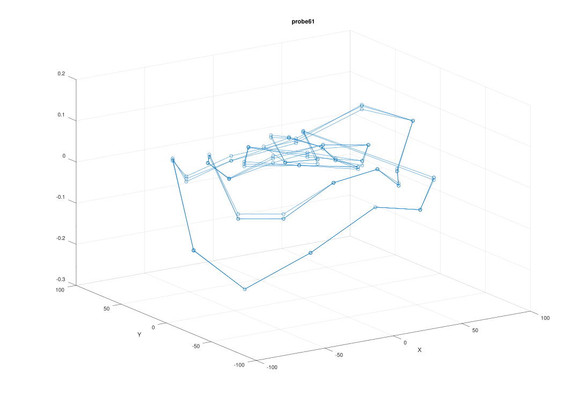

### 260819

Back from renovating rental. Note:
```
   Z_offset = (Z where probe triggers) - (Z where nozzle touches bed)
```

### 260820

New switch probe.
Z at bed keeps going up, at least for a while.
Initial nozzle touch at 0.225mm, then probe went up by
perhaps .06 on repeated probes, seemed to settle at .87.
Repeat nozzle touch at .27

Re-calibrated with new probe.   Results OK.
18 parameter optimization converged.
stable results.

### 260822

Got decent bed probe:
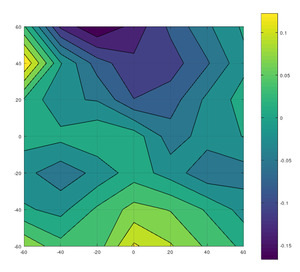

XY calibration is problematic.
Printed 100mm test "cube".
Sides not straight or square.
Vertical looks pretty straight and square.

I don't want to spend too much time calibrating
this configureation.
I think the next step is to move to the shorter
arms, and go through the whole calibration process again.

### 260906

Got new shorter arms a while ago.  180mm.
They usually sell these by carbon tube length,
so 180mm would be around 210mm arm length.
Re-ordered tubes and M3 heim joints to make my own.
Re-installing old arms, will need to re-calibrate.

Printed new mounts for tghe BiQU microprobe, and the Mellow Multihead Zero device.

### 260907

Got a very good probe from the Mellow Multihead Zero probe.
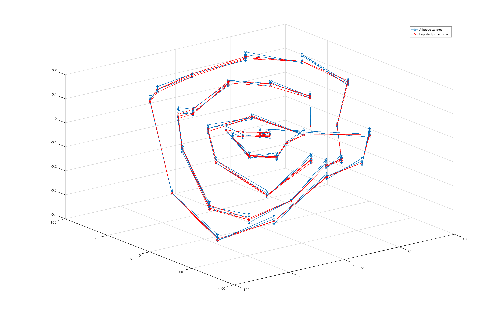
Google is down, so notes on probe:

calAE:
```
     median=-0.05;
     StDev =  .123;
     err=0.048139;
     endstop=[480.7930, 475.5129, 476.7947];
     arm=[285.942075 , 284.944120 , 285.907718];
```
     

This was after re-assembling arms, so they were certainly swapped.
I expect to see change in arm settings.
Previous params:
```
   delta_angles = 209.787   330.137    89.931
   delta_radius = 169.49   169.30   169.23
   arm_lengths =  286.04   285.97   286.03
   tilt_radial =  13.775   12.526   12.783
   tilt_tangential = 0.031834  -0.346611   0.705373
   position_endstops = 480.63   476.64   477.15
```

after probing with these updates, we get:
```
z stats: [median, mean, SD] = [ -0.005 , -0.002 , 0.0510 ]
```

For future reference, probe a bed mesh like :
```
   HOME
   BED_MESH_CALIBRATE PROFILE=myMeshLabel
   SAVE_CONFIG
   ...
   BED_MESH_PROFILE LOAD=myMeshLabel
   BED_MESH_OUTPUT  # I don't know if this works
   BED_MESH_CLEAR # turn off bed level compensation
```

Results with above arm-length and endstop update were:
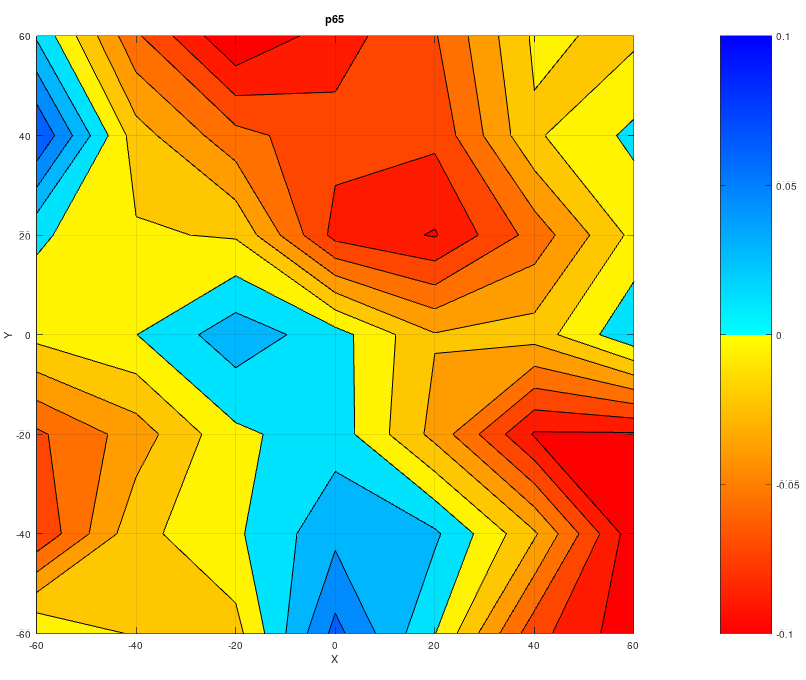

### 260908

Made cal print, and re-calibrated.
To use BiQu probe, I will need full 5-wire connection:
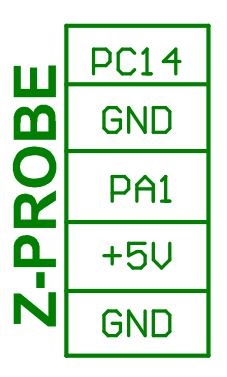

aargh.  Standard heim joints do not have enough side-to-side movement to be used for delta arms!!!

### 260909

measured cal print 066.
did probe066.log
Has bed Z median at -.6.
Tested paper touch at 0.55.
Probe at 0.551.
This does NOT seem to change with z_offset setting?!??.
How did print work?  We command to Z0, but bed is at Z-.6?

### 260911

Confusion about probe offset.
Starting (mostly) all over.
Loaded with parameters estimated from probe066.
It appears that logged probe values are estimated
cartesian location of nozzle.
They DO contain the probe offset.
Re-running with probe offset 2.35.
Reported probes are median 0.16.
measured probe touch at 3.24.
measured nozzle touch at 0.67.
offset check = trigger - nozzle touch = 2.51

aargh.

Running probe 68.  offset = 2.35.
